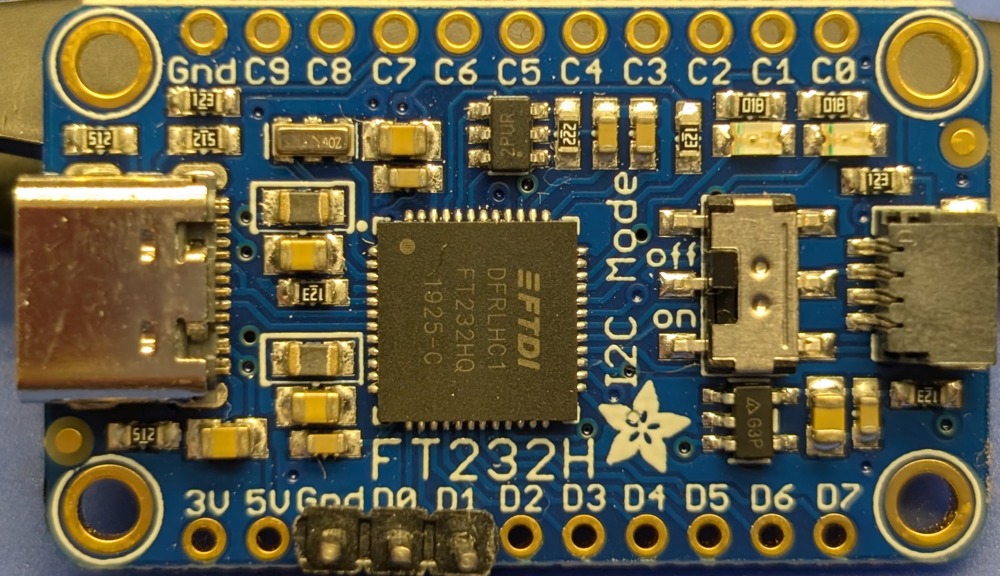
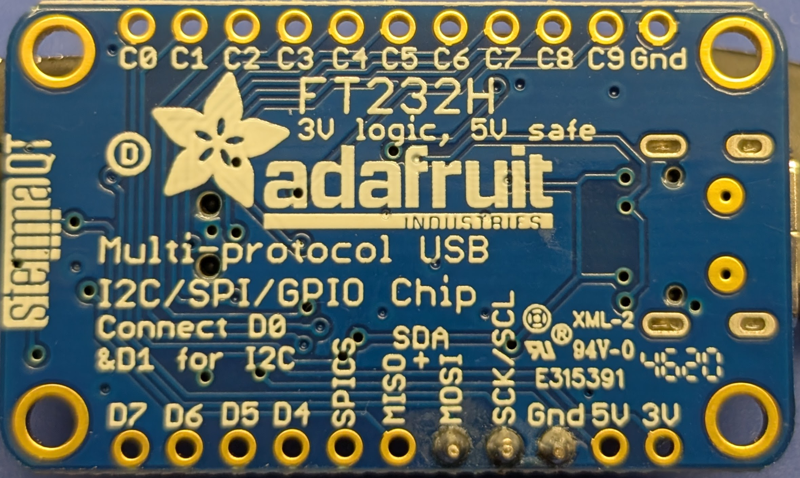
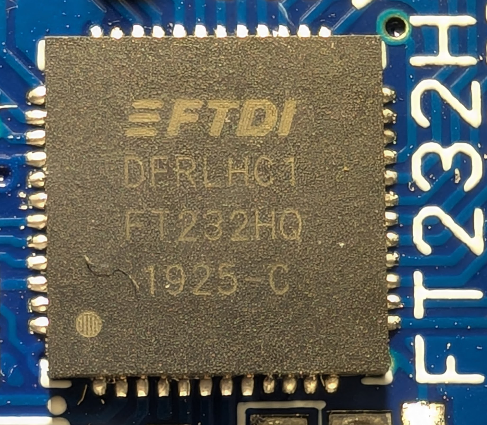

# Adafruit FT232H Breakout 2246

[Adafruit FT232H Breakout - General Purpose USB to GPIO, SPI, I2C - USB C & Stemma QT](https://www.adafruit.com/product/2264)





## Reference material:

* [Product Link](https://www.adafruit.com/product/2264)
* [Board designs](https://learn.adafruit.com/adafruit-ft232h-breakout/downloads)
* [Firmware update]()
* [Open firmware]()
* [OpenOCD support](http://openocd.sourceforge.net/doc/html/Debug-Adapter-Hardware.html)

## Board

Lots of markings. Kinda crowded, actually.

### Chip



Package QFN-48

Markings:

```text
FTDI
DFRLHC1
FT232HQ
1925-C
```

[Datasheet](http://www.ftdichip.com/Support/Documents/DataSheets/ICs/DS_FT232H.pdf)

Description (source):


## Firmware

There is on-chip firmware, but I didn't mess with it. 
